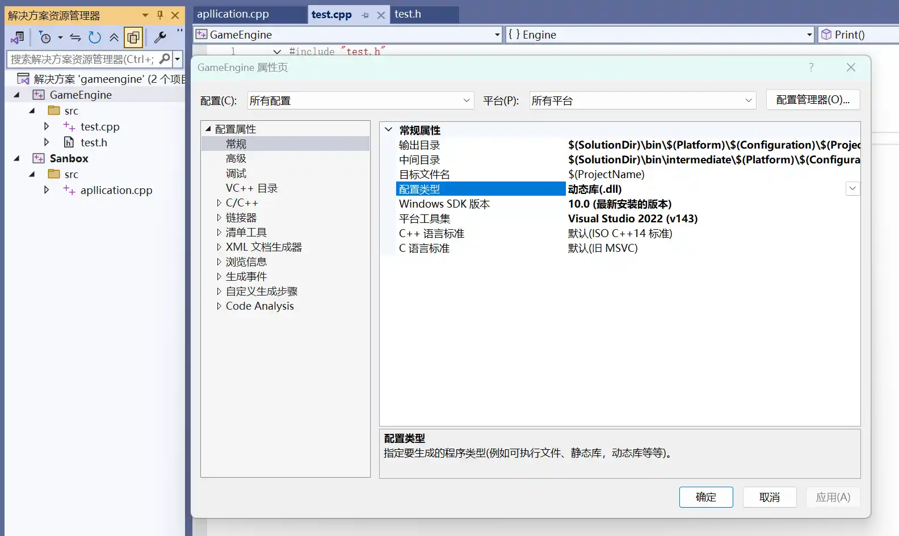
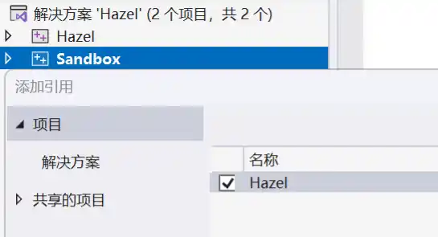
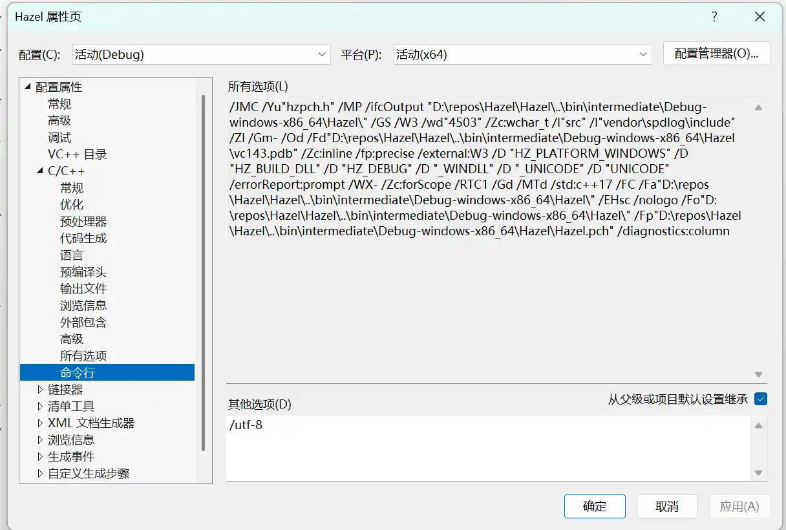

This blog template is built with [Astro](https://astro.build/). For the things that are not mentioned in this guide, you may find the answers in the [Astro Docs](https://docs.astro.build/).


# 一.什么是游戏引擎


创造游戏的工具Unity，Unreal

交互应用，可视化，平台

读取文件(资产，游戏引擎作为输入的文件)、转换他们、然后把他们放到屏幕上，并且也增加了交互能力。

### 一个游戏引擎需要什么？
| Attribute                 | Description                             |
|---------------------------|-----------------------------------------|
| `entry point`             | 入口                                    |
| `application layer`       | 应用层                                  |
| `window layer`            | 系统窗口层(input,event)                 |
| `renderer`                | 渲染器                                  |
| `Render API abstract`     | 渲染API抽象                             |
| `Debugging support`       | Debug支持                               |
| `Scripting languag`       | 脚本语言                                |
| `Memory System`           | 内存系统                                |
| `Entity-Component System` | 实体组件系统                            |
| `Physics`                 | 物理                                    |
| `File I/O`                | 文件I0(VFS)                             |
| `Build System`            | 构建系统                                |


# 二.项目设置

### 养成好习惯

指定单独的输出目录


新建src文件夹存储所有的代码文件

### 属性设置

将引擎设为动态库，新建一个游戏项目,新建两个项目,Hazel作为游戏引擎,Sandbox作为游戏




将Sandbox设置为启动项目

这里用剪切板打开Solusion,更改默认启动项目


将引擎链接到游戏(让游戏引用引擎)



- 说明

  此引用将会链接Hazel.lib文件。

- 问题:
  明明设置为dll为什么会有lib文件。

  解释:
  在动态库情况，有lib和dll两个文件，lib包含被DLL导出的函数的*名称和位置*，DLL包含实际的函数和数据。
  exe程序在编译期间链接lib文件，访问存放了DLL中所要调用的函数的内存地址

打开项目属性-链接器可以看到链接命令



# 三.测试

```cpp
$Hazel/Test.h

#pragma once
#include <stdio.h>
namespace Hazel {
	//这里dllexport只做测试用
	__declspec(dllexport) void Print();
}
```
```cpp
$Hazel/Test.cpp

#include "Test.h"
namespace Hazel {
	void Print()
	{
		printf("test");
	}
}
```
```cpp
$Sandbox/Application.cpp

namespace Hazel {
	//测试
	__declspec(dllimport) void Print();
}

void main() {
	Hazel::Print();
}
```

**我们所有的内容都会在Hazel命名空间中**

**这里先把Hazel生成的dll文件放到Sandbox的输出目录下，后面会处理成自动链接**

成功输出，Sandbox成功链接到Hazel


# Tips

**静态链接**

使用静态库方式链接，编译后链接时会将使用的库函数对应所包含库函数定义的==.o目标文件都包含在exe文件==中。

*优点*

执行速度快：因为可执行文件程序内部包含了所有需要执行的东西

*缺点*

浪费空间：因为多个可执行程序对同所需要的目标文件都有一份副本

更新慢：如果有一个.o目标文件发生改变，那么对应的使用这个.o目标文件的多个可执行程序需要重新来一遍链接过程，即链接多个.o目标文件来实现生成可执行文件。

**动态链接**

使用动态库方式链接，编译后因为推迟链接不会将使用的库函数对应的dll文件都包含在exe文件中，而是==在exe运行的时候将dll加载到内存CPU中再链接==。

*优点*

节省空间：多个可执行程序对同所需要的库函数共享一份副本

更新快：一个源文件发生改变，只需更新编译成dll文件，不用每个可执行程序需要重新来一遍链接过程，因为多个可执行程序在运行时时链接，且共享一份副本

*缺点*

启动速度慢：因为每次执行程序都需要链接

