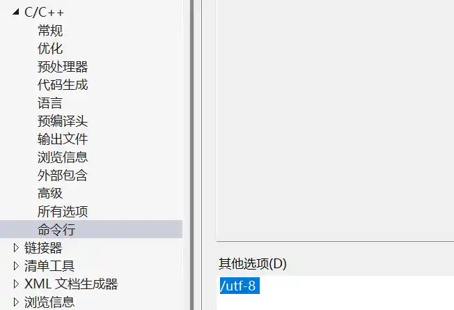
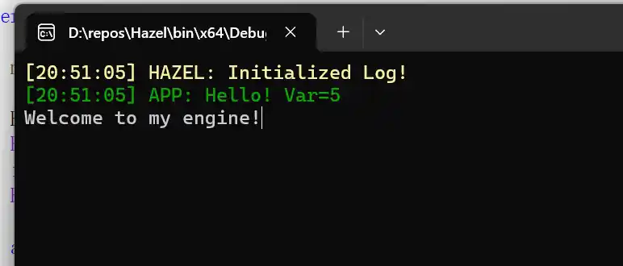

This blog template is built with [Astro](https://astro.build/). For the things that are not mentioned in this guide, you may find the answers in the [Astro Docs](https://docs.astro.build/).


# 一、准备工作：集成 spdlog 依赖

spdlog 是轻量级、高性能的 C++ 日志库，支持控制台彩色输出、文件日志、多线程安全等特性，适合作为引擎的基础日志工具。我们通过 Git 子模块将其集成到 Hazel 项目中，便于后续版本管理和更新。

## 1.1 用 Git 子模块添加 spdlog
在项目根目录打开终端，执行以下命令，将 spdlog 仓库作为子模块，下载到Hazel/vendor/spdlog目录（vendor 目录通常存放第三方依赖）：

```cmd
# git submodule add [远程仓库URL] [本地存放路径]
git submodule add https://github.com/gabime/spdlog.git Hazel/vendor/spdlog
```

**说明**：
- 若后续克隆项目时未自动下载 spdlog，需执行git submodule update --init --recursive拉取子模块代码；
- 子模块的优势：不直接将 spdlog 源码复制到项目中，而是记录依赖版本，避免代码冗余，且方便后续通过git submodule update更新 spdlog 版本。

## 1.2 配置项目包含目录

```lua
//premake5.lua
-- Hazel项目的includedirs配置（premake5.lua片段）
includedirs {
    "%{prj.name}/vendor/spdlog/include",  -- spdlog的头文件目录
    "%{prj.name}/src"
}
```

无需额外手动配置，重新运行generate.bat生成工程后，包含目录会自动生效。

# 二、封装 Log 类：统一日志接口
为了隔离第三方库（后续若替换日志库，无需修改业务代码），我们封装一个Log类，提供引擎核心日志和客户端（游戏项目）日志两种日志器，统一管理日志初始化和输出。

```cpp
//log.h
#include "Core.h"          // 引入HAZEL_API宏，用于导出类
#include <memory>          // 智能指针（std::shared_ptr）
#include "spdlog/spdlog.h" // spdlog核心头文件

namespace Hazel {
    // 日志类：封装spdlog，提供静态日志接口
    class HAZEL_API Log
    {
    public:
        // 初始化日志系统（需在程序启动时调用，如main函数开头）
        static void Init();

        // 获取引擎核心日志器（用于引擎内部模块，如渲染、内存）
        inline static std::shared_ptr<spdlog::logger>& GetCoreLogger() { return s_CoreLogger; }
        // 获取客户端日志器（用于游戏项目，如业务逻辑、关卡加载）
        inline static std::shared_ptr<spdlog::logger>& GetClientLogger() { return s_ClientLogger; }

    private:
        // 静态日志器对象（智能指针自动管理生命周期）
        static std::shared_ptr<spdlog::logger> s_CoreLogger;
        static std::shared_ptr<spdlog::logger> s_ClientLogger;
    };
}

// ------------------------------
// 日志宏定义：简化日志调用（核心日志）
// ------------------------------
// 跟踪级日志（最详细，用于调试细节，如函数进入/退出）
#define HZ_CORE_TRACE(...)    ::Hazel::Log::GetCoreLogger()->trace(__VA_ARGS__)
// 信息级日志（常规通知，如模块初始化完成）
#define HZ_CORE_INFO(...)     ::Hazel::Log::GetCoreLogger()->info(__VA_ARGS__)
// 警告级日志（非致命问题，如参数不合法但可恢复）
#define HZ_CORE_WARN(...)     ::Hazel::Log::GetCoreLogger()->warn(__VA_ARGS__)
// 错误级日志（功能故障，如模块初始化失败）
#define HZ_CORE_ERROR(...)    ::Hazel::Log::GetCoreLogger()->error(__VA_ARGS__)
// 致命级日志（程序无法继续运行，如内存分配失败）
#define HZ_CORE_FATAL(...)    ::Hazel::Log::GetCoreLogger()->fatal(__VA_ARGS__)

// ------------------------------
// 日志宏定义：简化日志调用（客户端日志）
// ------------------------------
#define HZ_TRACE(...)         ::Hazel::Log::GetClientLogger()->trace(__VA_ARGS__)
#define HZ_INFO(...)          ::Hazel::Log::GetClientLogger()->info(__VA_ARGS__)
#define HZ_WARN(...)          ::Hazel::Log::GetClientLogger()->warn(__VA_ARGS__)
#define HZ_ERROR(...)         ::Hazel::Log::GetClientLogger()->error(__VA_ARGS__)
#define HZ_FATAL(...)         ::Hazel::Log::GetClientLogger()->fatal(__VA_ARGS__)
```

**关键说明**：
- HAZEL_API：标记Log类为导出类，确保客户端项目（Sandbox）能正常调用；
- std::shared_ptr<spdlog::logger>：spdlog 推荐用智能指针管理日志器，避免内存泄漏；
- 宏定义中的__VA_ARGS__：表示 “可变参数”，支持像printf一样传入多个参数（如HZ_INFO("变量值：%d", a)）；
- 核心日志 vs 客户端日志：区分引擎底层日志和游戏业务日志，便于筛选和定位问题（如过滤出 “仅引擎错误”）。

```cpp
//log.cpp
#include "Log.h"
// spdlog的控制台彩色输出 sink（需包含此头文件才能创建彩色日志器）
#include "spdlog/sinks/stdout_color_sinks.h"

namespace Hazel {
    // 初始化静态日志器对象（类内声明，类外定义）
    std::shared_ptr<spdlog::logger> Log::s_CoreLogger;
    std::shared_ptr<spdlog::logger> Log::s_ClientLogger;

    // 日志系统初始化：配置日志格式、创建日志器、设置日志级别
    void Log::Init()
    {
        // ------------------------------
        // 1. 设置日志输出格式
        // 格式说明：%^[%T] %n: %v%$
        // - %^：开始彩色输出标记
        // - [%T]：时间戳（格式：HH:MM:SS）
        // - %n：日志器名称（如"HAZEL"、"APP"）
        // - %v：日志内容
        // - %$：结束彩色输出标记
        // ------------------------------
        spdlog::set_pattern("%^[%T] %n: %v%$");

        // ------------------------------
        // 2. 创建引擎核心日志器（名称：HAZEL）
        // stdout_color_mt：创建控制台彩色输出日志器，mt=multi-thread（多线程安全）
        // ------------------------------
        s_CoreLogger = spdlog::stdout_color_mt("HAZEL");
        // 设置日志级别：trace（最详细，包含所有级别日志）
        // 日志级别从低到高：trace < info < warn < error < fatal
        s_CoreLogger->set_level(spdlog::level::trace);

        // ------------------------------
        // 3. 创建客户端日志器（名称：APP）
        // ------------------------------
        s_ClientLogger = spdlog::stdout_color_mt("APP");
        s_ClientLogger->set_level(spdlog::level::trace);
    }
}
```

# 三、解决编译报错：配置 UTF-8 编码

直接编译会出现 “无法解析的外部符号” 或 “字符编码错误”，需在项目属性中添加/utf-8编译选项，确保编译器以 UTF-8 编码处理源码（避免中文注释或特殊字符导致的编译失败）。



# 四、集成到入口点：启动日志系统
日志系统需在程序启动时初始化（Log::Init()），之后才能使用日志宏打印信息。我们在引擎的统一入口（EntryPoint.h的main函数）中添加初始化逻辑。

修改入口点代码（$Hazel/EntryPoint.h）:

```cpp
#ifdef HZ_PLATFORM_WINDOWS
extern Hazel::Application* Hazel::CreateApplication();

int main(int argc,char** argv)
{
    // 1. 初始化日志系统（必须在打印日志前调用）
    Hazel::Log::Init();

    // 2. 测试引擎核心日志（级别：WARN）
    HZ_CORE_WARN("Initialized Log System!");

    // 3. 测试客户端日志（级别：INFO，带变量参数）
    int a = 5;
    HZ_INFO("Hello from Sandbox! Variable a = {0}", a);

    auto app = Hazel::CreateApplication();
    app->Run();
    delete app;
}
#endif
```

# 五、运行效果：彩色日志输出

编译并运行Sandbox项目，控制台会输出彩色日志，不同级别日志颜色不同（便于快速识别）：

核心日志（HAZEL）：
HZ_CORE_WARN：黄色字体 → [14:30:00] HAZEL: Initialized Log System!

客户端日志（APP）：
HZ_INFO：绿色字体 → [14:30:00] APP: Hello from Sandbox! Variable a = 5

其他级别日志颜色参考：
TRACE：灰色；ERROR：红色；FATAL：红色加粗（且会触发程序终止）。



# 六、后续优化方向

添加文件日志输出：除控制台外，将日志写入文件（如logs/hazel_core.log），便于后续排查历史问题；

日志级别动态调整：支持通过配置文件或命令行参数，动态修改日志级别（如发布版本仅输出WARN及以上级别）；

自定义日志格式：根据需求扩展日志格式（如添加线程 ID、文件路径、行号，便于定位代码位置）；

替换第三方库预留：若后续自研日志系统，只需修改Log类的实现，不影响外部调用（封装的优势）。
