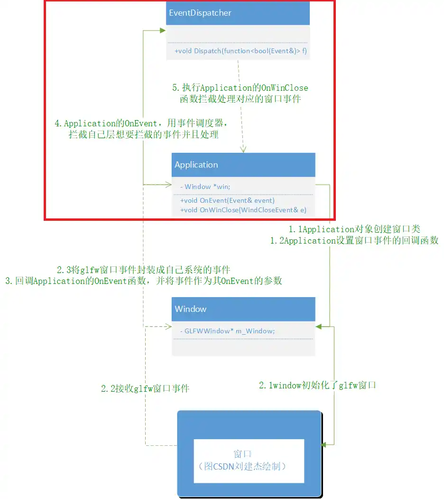
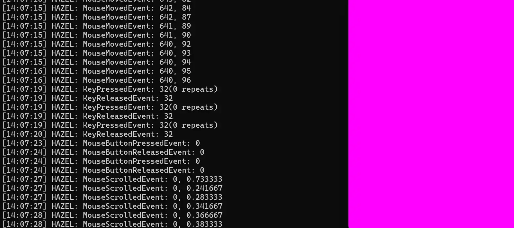
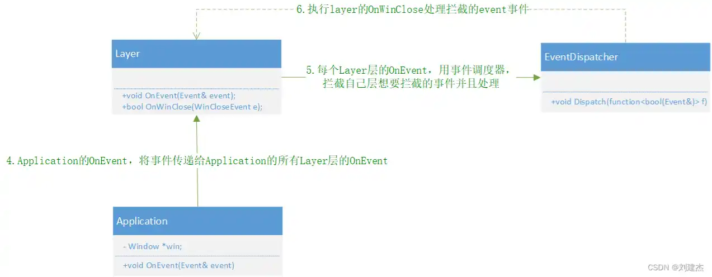
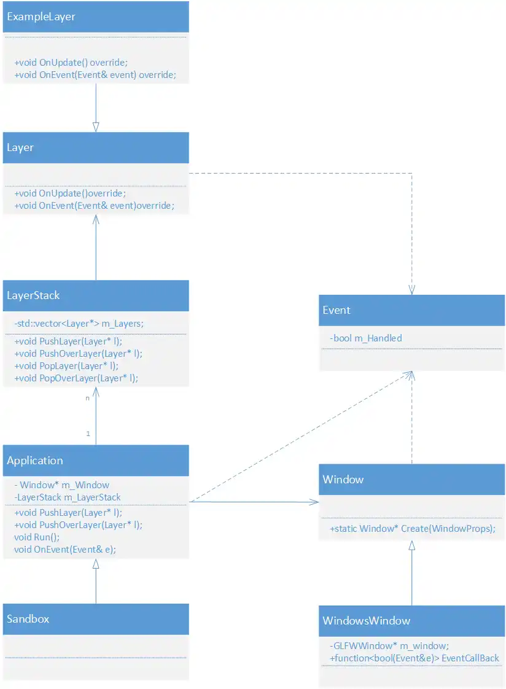
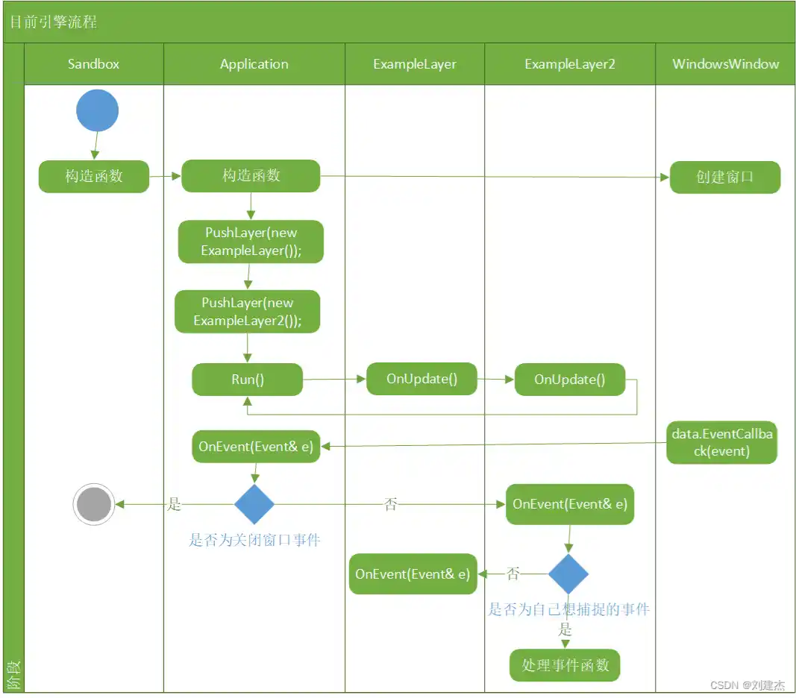
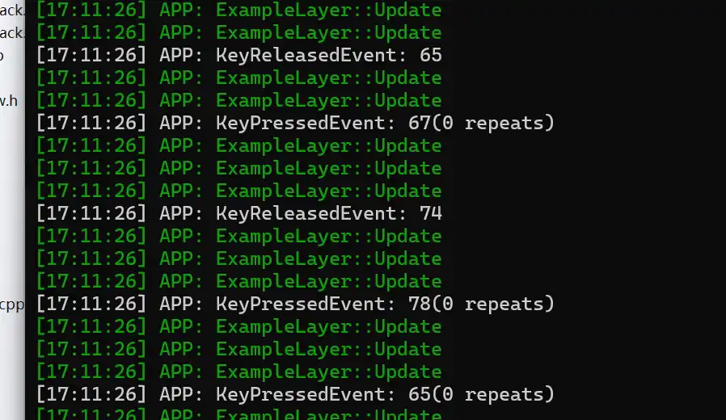

This blog template is built with [Astro](https://astro.build/). For the things that are not mentioned in this guide, you may find the answers in the [Astro Docs](https://docs.astro.build/).


# 一.规划事件系统


# 二.自定义事件类与使用

### 声明与定义类代码

- Event.h

  ```cpp
    /*
    	为了简便，自定义事件是立即处理事件，没有缓冲事件。
    	缓冲事件：键盘a一直按下第一个立刻输出，顿了一下才一直输出。
    */
    // 所有事件-一个类一个标识
    enum class EventType
  	{
        None = 0,
        WindowClose, WindowResize, WindowFocus, WindowLostFocus, WindowMoved,
        AppTick, AppUpdate, AppRender,
        KeyPressed, KeyReleased,
        MouseButtonPressed, MouseButtonReleased, MouseMoved, MouseScrolled
  	};
  
    // 事件种类
  	enum EventCategory
  	{
  		None = 0,
  		EventCategoryApplication	= BIT(0),
  		EventCategoryInput			= BIT(1),
  		EventCategoryKeyboard		= BIT(2),
  		EventCategoryMouse			= BIT(3),
  		EventCategoryMouseButton	= BIT(4)
  	};
  

    // 用宏定义更简洁的定义事件种类
    // 父类虚函数
    #define EVENT_CLASS_TYPE(type) static EventType GetStaticType() { return EventType::##type; }\
  								   virtual EventType GetEventType() const override { return GetStaticType(); }\
  								   virtual const char* GetName() const override { return #type; }
    // ##type，是保持为变量，#type是转换为字符串
  
    #define EVENT_CLASS_CATEGORY(category) virtual int GetCategoryFlags() const override { return category; }
  
  	class HAZEL_API Event
  	{
        friend class EventDispatcher;
  	public:
  		virtual EventType GetEventType() const = 0;
  		virtual const char* GetName() const = 0;
  		virtual int GetCategoryFlags() const = 0;
  		virtual std::string ToString() const { return GetName(); };
  
  		inline bool IsInCategory(EventCategory category)
  		{
  			return GetCategoryFlags() & category;
  		}
  
  		bool m_Handled = false;  // 事件处理状态
  	};
    ```

- WindowResizeEvent

  ```cpp
  $ApplicationEvent.h
  class HAZEL_API WindowResizeEvent : public Event
  {
    public:
        WindowResizeEvent(unsigned int width, unsigned int height)
			:m_Width(width), m_Height(height) {
		}

		inline unsigned int GetWidth() const { return m_Width; }
		inline unsigned int GetHeight() const { return m_Height; };

        // 重写ToString输出窗口宽高
		std::string ToString() const override
		{
			std::stringstream ss;
			ss << "WindowResizeEvent: " << m_Width << ", " << m_Height;
			return ss.str();
		}
		// 用宏定义来重写虚函数
		EVENT_CLASS_TYPE(WindowResize)
		EVENT_CLASS_CATEGORY(EventCategoryApplication)
	private:
		unsigned int m_Width, m_Height;
	};
  ```

- 用宏定义重写虚函数

  ```cpp
  // 宏定义：每个子类都需要重写父类虚函数代码，可以用宏定义简洁代码
  #define EVENT_CLASS_TYPE(type) static EventType GetStaticType() { return EventType::##type; }\
								virtual EventType GetEventType() const override { return GetStaticType(); }\
								virtual const char* GetName() const override { return #type; }

  #define EVENT_CLASS_CATEGORY(category) virtual int GetCategoryFlags() const override { return category; }
  
  EVENT_CLASS_TYPE(WindowResize)
  EVENT_CLASS_CATEGORY(EventCategoryApplication)
  // 会编译成
  static EventType GetStaticType() { return EventType::WindowResize; } 
  virtual EventType GetEventType() const override { return GetStaticType(); } 
  virtual const char* GetName() const override { return "WindowResize"; }
  virtual int GetCategoryFlags() const override { return EventCategoryApplication; }
  ```

  **##type**，是保持为变量，**#type**是转换为字符串

### 包含头文件

- premake的lua脚本中

  ```lua
  includedirs
  {
      "%{prj.name}/src",
      "%{prj.name}/vendor/spdlog/include"
  }
  ```

  所以Hazel项目的包含目录包含src目录

  ```cpp
  // 因为Event.h所在src/Hazel/Events/Event.h
  // 其它类包含Event.h，可以写成
  #include "Hazel/Events/Event.h"// 而不用前缀src
  ```

  重新编译

### 使用事件

- Application.h

  ```cpp
  #include "Core.h"
  #include "Events/Event.h"// 包含事件基类
  ```

- Application.cpp

  ```cpp
  #include "Application.h"
  #include "Hazel/Events/ApplicationEvent.h" // 包含具体事件
  #include "Hazel/Log.h"
  
  namespace Hazel {
  	Application::Application(){}
  	Application::~Application(){}
  	void Application::Run()
  	{
  		WindowResizeEvent e(1280, 720);	// 使用自定义事件
  		if (e.IsInCategory(EventCategoryApplication))	// 判断是否对应的分类
  		{
  			HZ_TRACE(e);	// 输出事件
  		}
  		if (e.IsInCategory(EventCategoryInput))
  		{
  			HZ_TRACE(e);
  		}
  		while (true);
  	}
  }
  ```

- 效果

  

### 事件调度器代码

```cpp
$Event.h
// 事件调度器类
class EventDispatcher
{
    template<typename T>
    using EventFn = std::function<bool(T&)>;// 声明function，接受返回类型bool，参数是T&的函数
    public:
    EventDispatcher(Event& event)
        : m_Event(event)
        { }
    template<typename T>
    bool Dispatch(EventFn<T> func)// function参数接收函数指针
    {
        // 拦截的事件和想处理的事件类型是否匹配
        // GetEventType()是被重写的函数
        if (m_Event.GetEventType() == T::GetStaticType())
        {
            m_Event.m_Handled = func(*(T*)&m_Event);// 处理拦截的事件
            return true;
        }
        return false;
    }
    private:
        Event& m_Event;// 拦截的事件
};
```


----------------------------------------
# 三.窗口

## (一)窗口抽象和GLFW创建窗口

步骤

### 1.GIT添加GLFW子模块及编译

- 添加glfw子模块

  ```cmd
  git add submodule https://github.com/TheCherno/glfw Hazel/vendor/GLFW
  ```
- 
  TheCherno的premake是不对的，会报错

  解决方案：更改premake

  ```lua
  	filter "configurations:Debug"
      defines "HZ_DEBUG"
      buildoptions "/MTd"
      symbols "On"
  
      filter "configurations:Release"
      defines "HZ_RELEASE"
      buildoptions "/MT"
      symbols "On"
  
      filter "configurations:Dist"
      defines "HZ_DIST"
      buildoptions "/MT"
      symbols "On"
  ```

- 修改premake

  解决方案下的premake修改

  ```lua
  -- 包含相对解决方案的目录
  IncludeDir = {}
  IncludeDir["GLFW"] = "Hazel/vendor/GLFW/include"
  -- 这个include，相当于把glfw下的premake5.lua内容拷贝到这里
  include "Hazel/vendor/GLFW"
  project "Hazel"		--Hazel项目
  	location "Hazel"--在sln所属文件夹下的Hazel文件夹
  	kind "SharedLib"--dll动态库
  	-- 包含目录
  	includedirs{
  	    "%{prj.name}/src",
  	    "%{prj.name}/vendor/spdlog/include",
  	    "%{IncludeDir.GLFW}"
  	}
  	-- Hazel链接glfw项目
  	links 
  	{ 
  	    "GLFW",
  	    "opengl32.lib"
  	}
  	filter "system:windows"
  	    defines{
  		    "HZ_PLATFORM_WINDOWS",
  		    "HZ_ENABLE_ASSERTS"
  		}
  ```


### 2.Window类

- 目前类图

  

  Application类可以调用创建窗口函数，而窗口类使用glfw库创建**真正的**窗口。

  窗口类**检测**glfw窗口的事件，并**回调**给Application的处理事件函数。

- 代码

  window.h

  ```cpp
  #pragma once
  #include "hzpch.h"
  #include "Hazel/Core.h"
  #include "Hazel/Events/Event.h"
  namespace Hazel {
  	struct WindowProps{// 窗口初始化设置的内容
  		std::string Title;
  		unsigned int Width;
  		unsigned int Height;
  		WindowProps(const std::string& title = "Hazel Engine",
  			unsigned int width = 1280,
  			unsigned int height = 720)
  			: Title(title), Width(width), Height(height){}
  	};
  	class HAZEL_API Window{
  	public:
        using EventCallbackFn = std::function<void(Event&)>;
        virtual ~Window() {}
        virtual void OnUpdate() = 0;
        virtual unsigned int GetWidth() const = 0;
        virtual unsigned int GetHeight() const = 0;
        // Window attributes
        virtual void SetEventCallback(const EventCallbackFn& callback) = 0;
        virtual void SetVSync(bool enabled) = 0;
        virtual bool IsVSync() const = 0;
        // 在Window父类声明创建函数
        static Window* Create(const WindowProps& props = WindowProps());
  	};
  }
  ```

  WindowsWindow.h

  ```cpp
  #pragma once
  #include "Hazel/Window.h"
  #include <GLFW/glfw3.h>
  namespace Hazel {
  	class WindowsWindow : public Window{
  	public:
  		WindowsWindow(const WindowProps& props);
  		virtual ~WindowsWindow();
  		void OnUpdate() override;
  		inline unsigned int GetWidth() const override { return m_Data.Width; }
  		inline unsigned int GetHeight() const override { return m_Data.Height; }
  		// 设置Application的回调函数
  		inline void SetEventCallback(const EventCallbackFn& callback) override { m_Data.EventCallback = callback; }
  		void SetVSync(bool enabled) override;
  		bool IsVSync() const override;
  	private:
  		virtual void Init(const WindowProps& props);
  		virtual void Shutdown();
  	private:
  		GLFWwindow* m_Window;
  		struct WindowData{
  			std::string Title;
  			unsigned int Width, Height;
  			bool VSync;
  			EventCallbackFn EventCallback;
  		};
  		WindowData m_Data;
  	};
  }
  ```

  WindowsWindow.cpp

  ```cpp
  #include "hzpch.h"
  #include "WindowsWindow.h"
  
  namespace Hazel {
  
  	static bool s_GLFWInitialized = false;
  
  	// 在WindowsWindow子类定义在Window父类声明的函数
  	Window* Window::Create(const WindowProps& props) { return new WindowsWindow(props); }
  
  	WindowsWindow::WindowsWindow(const WindowProps& props) { Init(props); }
  
  	WindowsWindow::~WindowsWindow()
  	{
  		Shutdown();
  	}
  
  	void WindowsWindow::SetVSync(bool enabled)
  	{
  		if (enabled)
  			glfwSwapInterval(1);
  		else
  			glfwSwapInterval(0);
  
  		m_Data.VSync = enabled;
  	}
  
  	bool WindowsWindow::IsVSync() const
  	{
  		return m_Data.VSync;
  	}
  
  	void WindowsWindow::Init(const WindowProps& props)
  	{
  		m_Data.Title = props.Title;
  		m_Data.Width = props.Width;
  		m_Data.Height = props.Height;
  
  		HZ_CORE_INFO("Creating window {0} ({1}, {2})", props.Title, props.Width, props.Height);
  
  		if (!s_GLFWInitialized)
  		{
  			// TODO: glfwTerminate on system shutdown
  			int success = glfwInit();
  			HZ_CORE_ASSERT(success, "Could not intialize GLFW!");// 断言，Core.h里面预处理器指令定义了HZ_CORE_ASSERT
  			s_GLFWInitialized = true;
  		}
  
  		// 创建窗口----------------------------------------------------------------------
  		m_Window = glfwCreateWindow((int)props.Width, (int)props.Height, m_Data.Title.c_str(), nullptr, nullptr);
  		// 设置glfw当前的上下文
  		glfwMakeContextCurrent(m_Window);
  		/*
  			设置窗口关联的用户数据指针。这里GLFW仅做存储，不做任何的特殊处理和应用。
  			window表示操作的窗口句柄。
  			pointer表示用户数据指针。
  		*/
  
  		glfwSetWindowUserPointer(m_Window, &m_Data);
  		SetVSync(true);
  	}
  
  	void WindowsWindow::Shutdown()
  	{
  		glfwDestroyWindow(m_Window);
  	}
  
  	void WindowsWindow::OnUpdate() 
  	{
  		glfwPollEvents();			// 轮询事件	
  		glfwSwapBuffers(m_Window);	// 交换缓冲
  	}
  
  }
  
  ```

- HZ_CORE_ASSERT断言

  在Core.h中

  ```cpp
  #ifdef HZ_ENABLE_ASSERTS
  #define HZ_ASSERT(x, ...) { if(!(x)) { HZ_ERROR("Assertion Failed: {0}", __VA_ARGS__); __debugbreak(); } }
  #define HZ_CORE_ASSERT(x, ...) { if(!(x)) { HZ_CORE_ERROR("Assertion Failed: {0}", __VA_ARGS__); __debugbreak(); } }
  #else
  #define HZ_ASSERT(x, ...)
  #define HZ_CORE_ASSERT(x, ...)
  #endif
  ```

  ```cpp
  HZ_CORE_ASSERT(success, "Could not intialize GLFW!");
  // 转换成
  { if(!(success)) { ::Hazel::Log::GetCoreLogger()->error("Assertion Failed: {0}", "Could not intialize GLFW!"); __debugbreak(); } };
  ```

  …当做参数包被__VA_ARGS__展开；__debugbreak();是在debug模式下的断点

## (二)GLFW窗口事件

### 如何确定GLFW窗口事件的回调函数参数

- 引出

  ```cpp
  glfwSetKeyCallback(m_Window, [](GLFWwindow* window, int key, int scancode, int action, int mods)
  ```

  如上代码，用lambda接收GLFW按键事件，怎么确定lambda的**参数**

- ctrl+左键点开glfwSetKeyCallback

  

  不知道使用什么参数查一下就好了

### Application接收事件回调流程

项目流程(12345)

按照1、2、3、4、5顺序



- 在Application实现事件系统

  ```cpp
  $Application.cpp

  #include "hzpch.h"
  
  #include "Application.h"
  #include <stdio.h>
  
  #include "Hazel/Events/MouseEvent.h"
  #include "Hazel/Log.h"
  
  #include <GLFW/glfw3.h>
  
  namespace Hazel {
  
  #define BIND_EVENT_FN(x) std::bind(&Application::x, this, std::placeholders::_1)
  
  	Application::Application() 
  	{
        // 创建窗口，设置回调
  		m_Window = std::unique_ptr<Window>(Window::Create());
  		m_Window->SetEventCallback(BIND_EVENT_FN(OnEvent));
  	}
  
    // 事件调度器，处理希望的事件
  	void Application::OnEvent(Event& e)
  	{
  		EventDispatcher dispatcher(e);
  		dispatcher.Dispatch<WindowClosedEvent>(BIND_EVENT_FN(OnWindowClose));
  
  		HZ_CORE_TRACE("{0}", e.ToString());
  	}
  
    // 窗口关闭
  	bool Application::OnWindowClose(WindowClosedEvent& e)
  	{
  		m_Running = false;
  		return true;
  	}
  }
  ```

- WindowsWindow.cpp

  ```cpp
  glfwSetWindowSizeCallback(m_Window, [](GLFWwindow* window, int width, int height){
  	// glfwGetWindowUserPointer获取void*指针可以转换为由glfwSetWindowUserPointer自定义数据类型，
      WindowData& data = *(WindowData*)glfwGetWindowUserPointer(window);
      data.Width = width;
      data.Height = height;
  
  	// 2.3将glfw窗口事件转换为自定义的事件
      WindowResizeEvent event(width, height);
  	// 3.回调Application的OnEvent函数，并将事件作为其OnEvent的参数
      data.EventCallback(event);
  });
  ```

- 效果

  

- 调度器实现窗口关闭

  ```cpp
  EventDispatcher(Event& event)
  	: m_Event(event){ }
  
  template<typename T>
  bool Dispatch(EventFn<T> func)
  {
  	// 若调度器事件与T类型一致，执行func
  	if(m_Event.GetEventType() == T::GetStaticType())
  	{
  		m_Event.m_Handled = func(*(T*)&m_Event);
  		return true;
  	}
  	return false;
  }
  ```

  ```cpp
  #define BIND_EVENT_FN(x) std::bind(&Application::x, this, std::placeholders::_1)
  void Application::OnEvent(Event& e)
  {
  	EventDispatcher dispatcher(e);
  	dispatcher.Dispatch<WindowClosedEvent>(BIND_EVENT_FN(OnWindowClose));
  
  	HZ_CORE_TRACE("{0}", e.ToString());
  }
  bool Application::OnWindowClose(WindowClosedEvent& e)
  {
  	m_Running = false;
  	return true;
  }
  ```

  如果传入调度器的事件是WindowClosedEvent，则执行OnWindowClose

  
# 四.图层Layer

### 前言

- 此节目的

  - 为完成事件系统设计的第四步，将事件从Application传递分发给Layer层。

    

- Layer的理解

  想象同Ps中一张图有多个层级，可以在层级上绘制图画

- Layer的设计

  - 数据结构：vector

  - 渲染顺序

    **从前往后**渲染各个层的图像，这样后面渲染的会覆盖前面渲染的图像，在屏幕的最顶层。

  - 处理事件顺序

    **从后往前**依次处理事件，当一个事件被一个层处理完不会传递给前一个层，结合渲染顺序，这样在屏幕最顶层的（也就是在vector最后的layer）图像**最先**处理事件。

  - 例子解释

    比如常见的3D游戏有UI。

    渲染顺序：将3D图形先渲染，再渲染2DUI，这样屏幕上2DUI永远在3D图形上方，显示正确；

    事件顺序：点击屏幕的图形，应该是2DUI最先处理，如果是相应UI事件，处理完后**不传递**给前一个3D层，若不是自己的UI事件，**才传递**给前一个3D层。


##### 增加Layer后的主要类图



注意区分LayerStack、Layer以及ExampleLayer

- **LayerStack**

  管理Layer层的类

- **Layer**

  所有层的父类，定义了虚函数

- **Examplayer**

  真正需要更新和处理事件的层，被添加到LayerStack的vector中

### 项目相关

代码

- Layer

  ```cpp
  #pragma once
  #include "Hazel/Core.h"
  #include "Hazel/Events/Event.h"
  namespace Hazel {
  	class HAZEL_API Layer
  	{
  	public:
  		Layer(const std::string& name = "Layer");
  		virtual ~Layer();
  		virtual void OnAttach() {} // 应用添加此层执行
  		virtual void OnDetach() {} // 应用分离此层执行
  		virtual void OnUpdate() {} // 每层更新
  		virtual void OnEvent(Event& event) {}// 每层处理事件
  		inline const std::string& GetName() const { return m_DebugName; }
  	protected:
  		std::string m_DebugName;
  	};
  }
  ```

- LayerStack

  ```cpp
  #pragma once
  namespace Hazel {
  	class HAZEL_API LayerStack{
  	public:
  		LayerStack();
  		~LayerStack();
  		void PushLayer(Layer* layer);	// vector在头部添加一个层
  		void PushOverlayer(Layer* overlayer);// 在vector末尾添加一个覆盖层，在屏幕的最上方的层
  		void PopLayer(Layer* layer);	// vector弹出指定层
  		void PopOverlayer(Layer* overlayer);// vector弹出覆盖层
  		std::vector<Layer*>::iterator begin() { return m_Layers.begin(); }
  		std::vector<Layer*>::iterator end() { return m_Layers.end(); }
  	private:
  		std::vector<Layer*> m_Layers;
  		std::vector<Layer*>::iterator m_LayerInsert;
  	};
  }
  ```

  ```cpp
  namespace Hazel {
  	LayerStack::LayerStack(){
  		m_LayerInsert = m_Layers.begin();
  	}
  	LayerStack::~LayerStack(){
  		for (Layer* layer : m_Layers)
  			delete layer;
  	}
  	void LayerStack::PushLayer(Layer* layer){
  		// emplace在vector容器指定位置之前插入一个新的元素。返回插入元素的位置
  		// 插入 1 2 3，vector是 3 2 1
  		m_LayerInsert = m_Layers.emplace(m_Layers.begin(), layer);
  	}
  	void LayerStack::PushOverlay(Layer* overlay){
  		m_Layers.emplace_back(overlay);
  	}
  	void LayerStack::PopLayer(Layer* layer){
  		auto it = std::find(m_Layers.begin(), m_Layers.end(), layer);
  		if (it != m_Layers.end()){
  			m_Layers.erase(it);
  			m_LayerInsert--;	// 指向Begin
  		}
  	}
  	void LayerStack::PopOverlay(Layer* overlay){
  		auto it = std::find(m_Layers.begin(), m_Layers.end(), overlay);
  		if (it != m_Layers.end())
  			m_Layers.erase(it);
  	}
  }
  ```

- SandboxApp

  ```cpp
  class ExampleLayer : public Hazel::Layer{
  public:
  	ExampleLayer()
  		: Layer("Example"){}
  	void OnUpdate() override{
  		HZ_INFO("ExampleLayer::Update");	// 最终会被输出
  	}
  	void OnEvent(Hazel::Event& event) override{
  		HZ_TRACE("{0}", event);	// 最终会被输出
  	}
  };
  class Sandbox : public Hazel::Application{
  public:
  	Sandbox(){
  		PushLayer(new ExampleLayer());
  	}
  	~Sandbox(){}
  };
  ```

- Application

  ```cpp
  void Application::PushLayer(Layer* layer){
      m_LayerStack.PushLayer(layer);
  }
  
  void Application::PushOverlay(Layer* layer){
      m_LayerStack.PushOverlay(layer);
  }
  // 回调glfw窗口事件的函数
  void Application::OnEvent(Event& e){
      // 4.用事件调度器，拦截自己层想要拦截的事件并处理
      EventDispatcher dispatcher(e);
      dispatcher.Dispatch<WindowCloseEvent>(BIND_EVENT_FN(OnWindowClose));
  
      // 从后往前顺序处理事件
      for (auto it = m_LayerStack.end(); it != m_LayerStack.begin(); ){
          (*--it)->OnEvent(e);
          if (e.Handled)// 处理完就不要传入前一个层
              break;
      }
  }
  void Application::Run(){
      while (m_Running){
          glClearColor(1, 0, 1, 1);
          glClear(GL_COLOR_BUFFER_BIT);
  
          // 从前往后顺序更新层
          for (Layer* layer : m_LayerStack)
              layer->OnUpdate();
  
          m_Window->OnUpdate();	// 更新glfw
      }
  }
  ```

### 项目流程

- 文字

  1. Application定义了LayerStack对象m_LayerStack
  2. 在Sandbox构造函数中，执行PushLayer(new ExampleLayer());，将ExampleLayer放入m_LayerStack的vector中
  3. Application的OnEvent函数从后往前顺序遍历m_LayerStack的vector，得到ExampleLayer对象，并把事件e作为参数执行它的OnEvent函数，所以一直在控制台输出**窗口事件**
  4. Application的OnUpdate函数从前往后遍历m_LayerStack的vector，得到ExampleLayer对象，并执行它的OnUpdate函数，所以一直在控制台输出**“ExampleLayer::Update”**

- 图示

  

### 效果




