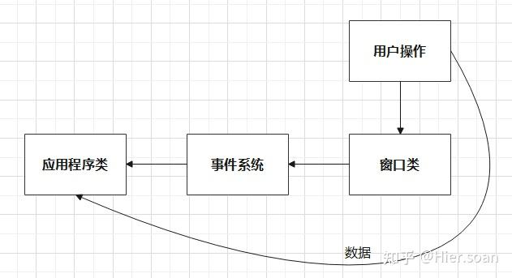
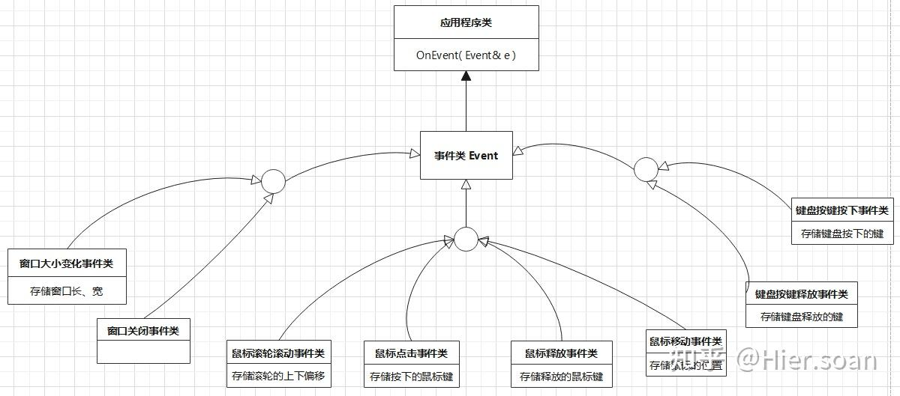

This blog template is built with [Astro](https://astro.build/). For the things that are not mentioned in this guide, you may find the answers in the [Astro Docs](https://docs.astro.build/).


# 事件系统

我们的游戏引擎需要一个窗口，用户在窗口上的操作应该被传递到应用程序，我们使用事件系统完成这个任务

显然，我们的窗口由application创建，**窗口一定不知道应用程序**，所以我们需要**回调函数**，当窗口监测到事件时2，就会调用相应的回调函数通过事件系统传递给应用程序

## 一. 规划事件系统

以 glfwSetCursorPosCallback 为例，鼠标移动时会调用先前注册好的回调函数，并传入xpos和ypos。而作为接收事件的Application类，最需要的就是xpos和ypos，以进行之后更多的逻辑处理。因此对于鼠标移动这个事件来说，事件系统的任务就是把xpos和ypos从Window类传递到Application类。

我们的事件系统初步规划：






- Event
  
  ```cpp
  
  /*
  	为了简便，自定义事件是立即处理事件，没有缓冲事件。
  	缓冲事件：键盘a一直按下第一个立刻输出，顿了一下才一直输出。
  */
  // 事件类别-一个类一个标识
  enum class EventType{
      None = 0,
      WindowClose, WindowResize, WindowFocus, WindowLostFocus, WindowMoved,
      AppTick, AppUpdate, AppRender,
      KeyPressed, KeyReleased,
      MouseButtonPressed, MouseButtonReleased, MouseMoved, MouseScrolled
  };
  // 事件分类-多个类一个分类，即多个类属于同一个分类
  enum EventCategory
  {
      None = 0,
      EventCategoryApplication	= BIT(0),	// 1
      EventCategoryInput			= BIT(1),	// 2
      EventCategoryKeyboard		= BIT(2),	// 4
      EventCategoryMouse			= BIT(3),	// 8
      EventCategoryMouseButton	= BIT(4)	// 16
  };
  // 子类重写父类虚函数代码
  // 用宏定义简洁代码
  #define EVENT_CLASS_TYPE(type) static EventType GetStaticType() { return EventType::##type; }\
  								virtual EventType GetEventType() const override { return GetStaticType(); }\
  								virtual const char* GetName() const override { return #type; }
  
  #define EVENT_CLASS_CATEGORY(category) virtual int GetCategoryFlags() const override { return category; }
  
  class HAZEL_API Event
  {
      friend class EventDispatcher;
      public:
      virtual EventType GetEventType() const = 0; // 获取本事件是哪个类型
      virtual const char* GetName() const = 0; // 获取本事件的名称c字符数组
      virtual int GetCategoryFlags() const = 0;	// 获取本事件属于哪个分类
      virtual std::string ToString() const { return GetName(); } // 获取本事件的名称从c字符数组转为字符串
  
      inline bool IsInCategory(EventCategory category)
      {
          return GetCategoryFlags() & category;
      }
      protected:
      bool m_Handled = false;
  };
  ```

- WindowResizeEvent
  
  ```cpp
  class HAZEL_API WindowResizeEvent : public Event
  {
      public:
      WindowResizeEvent(unsigned int width, unsigned int height)
          : m_Width(width), m_Height(height) {}
  
      inline unsigned int GetWidth() const { return m_Width; }
      inline unsigned int GetHeight() const { return m_Height; }
  
      std::string ToString() const override
      {
          std::stringstream ss;
          ss << "WindowResizeEvent: " << m_Width << ", " << m_Height;
          return ss.str();
      }
  	// 关键地方：用宏定义来重写虚函数
      EVENT_CLASS_TYPE(WindowResize)
          EVENT_CLASS_CATEGORY(EventCategoryApplication)
          private:
      unsigned int m_Width, m_Height;
  };
  ```

```cpp
#define EVENT_CLASS_TYPE(type) static EventType GetStaticType() { return EventType::##type; }\
								virtual EventType GetEventType() const override { return GetStaticType(); }\
								virtual const char* GetName() const override { return #type; }

EVENT_CLASS_TYPE(WindowResize)
EVENT_CLASS_CATEGORY(EventCategoryApplication)
// 会编译成
static EventType GetStaticType() { return EventType::WindowResize; } virtual EventType GetEventType() const override { return GetStaticType(); } virtual const char* GetName() const override { return "WindowResize"; }
virtual int GetCategoryFlags() const override { return EventCategoryApplication; }
```

##type，是保持为变量，#type是转换为字符串

# 三.使用事件

```cpp
$application.h

#include "Core.h"
#include "Events/Event.h"// 包含事件基类
```
```cpp
$Application.cpp

#include "Application.h"
#include "Hazel/Events/ApplicationEvent.h" // 包含具体事件
#include "Hazel/log.h"

namespace Hazel {
	Application::Application(){}
	Application::~Application(){}
	void Application::Run()
	{
		WindowResizeEvent e(1280, 720);	// 使用自定义事件
		if (e.IsInCategory(EventCategoryApplication)) // 判断是否对应的分类
		{
			HZ_TRACE(e);	// 输出事件
		}
		if (e.IsInCategory(EventCategoryInput))
		{
			HZ_TRACE(e);
		}
		while (true);
	}
}
```
效果

请添加图片描述

事件调度器代码
```cpp
// 事件调度器类
class EventDispatcher
{
    template<typename T>
    using EventFn = std::function<bool(T&)>; // 声明function，接受返回类型bool，参数是T&的函数
    public:
    EventDispatcher(Event& event)
        : m_Event(event)
        {
        }
    template<typename T>
    bool Dispatch(EventFn<T> func)  // function参数接收函数指针
    {
        if (m_Event.GetEventType() == T::GetStaticType()) // 拦截的事件和想处理的事件类型是否匹配
        {
            m_Event.m_Handled = func(*(T*)&m_Event); // 处理拦截的事件
            return true;
        }
        return false;
    }
    private:
    Event& m_Event;	// 拦截的事件
};
```

这个类的本身与作用由于（function+模板）变得很难看懂，可以看结合开头的事件设计图和后面的function基本使用代码一步一步理解