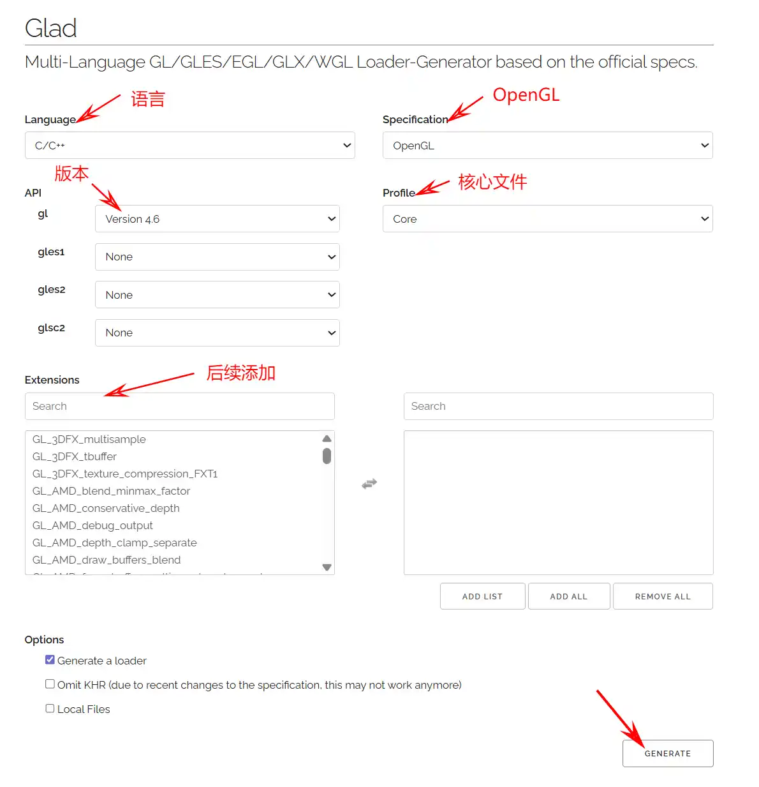

This blog template is built with [Astro](https://astro.build/). For the things that are not mentioned in this guide, you may find the answers in the [Astro Docs](https://docs.astro.build/).

在自研游戏引擎的开发中，目前已完成窗口系统（基于 GLFW）、事件系统和层系统的搭建，本以为能顺利进入 OpenGL 渲染环节，却在 “OpenGL 函数加载” 上遇到了阻碍。手动处理跨平台加载逻辑不仅繁琐，还容易出错，最终通过 Glad 工具解决了这一问题。以下是具体的学习过程和操作记录，供参考。
# 一、遇到的问题：OpenGL 函数加载的跨平台困境
OpenGL 与常规库不同，其核心函数**无法在编译时自动链接**，需在运行时从显卡驱动中动态加载。更麻烦的是，不同操作系统的加载接口存在差异：
- Windows 需使用wglGetProcAddress；
- Linux 需使用glXGetProcAddress；
- 后续若移植到 macOS，还需适配CGL相关接口。

此时意识到，需要一个工具来自动生成跨平台的 OpenGL 加载代码，Glad 正是为此设计的。

# 二、Glad 的下载与配置：按引擎需求定制代码
Glad 需根据 OpenGL 版本和功能需求生成专属代码，操作步骤如下：
1. 官网参数配置
访问 [Glad 官网](https://glad.dav1d.de/)，结合引擎需求配置参数，重点关注以下选项：



2. 代码文件结构整理
解压后仅保留核心文件，避免项目目录冗余，关键结构如下：
```plaintext
Hazel/vendor/
├─ Glad/
   ├─ include/  # 头文件目录，需添加到项目包含路径
   │  ├─ glad/
   │  │  └─ glad.h      # OpenGL函数声明核心文件
   │  └─ KHR/
   │     └─ khrplatform.h # 备用头文件，部分编译器需此路径
   └─ src/      # 源文件目录
      └─ glad.c # OpenGL加载逻辑实现，仅需编译这一个文件
```

# 三、第三方库 Glad 集成到引擎项目(Premake5)

Glad 独立项目脚本（vendor/Glad/premake5.lua）
Glad 需编译为静态库，核心是加载 OpenGL 函数，跨平台以后再做，脚本如下：

```lua
//Glad/premake5.lua
project "Glad"
    kind "StaticLib"
    language "C"
    staticruntime "off"
    
    targetdir ("bin/" .. outputdir .. "/%{prj.name}")
    objdir ("bin-int/" .. outputdir .. "/%{prj.name}")

    files
    {
        "include/glad/glad.h",
        "include/KHR/khrplatform.h",
        "src/glad.c"
    }

    includedirs
    {
        "include"
    }
    
    filter "system:windows"
        systemversion "latest"

    filter "configurations:Debug"
        runtime "Debug"
        symbols "on"

    filter "configurations:Release"
        runtime "Release"
        optimize "on"
```
修改项目preamke5.lua,引入 Glad 独立项目，确保引擎项目能找到这个依赖。跟GLFW一样，这里不再重复

# 四、功能验证：确保 Glad 加载成功并可用

Glad 集成后需验证是否能正常加载 OpenGL 函数，避免后续渲染环节出错。

## 1. 在窗口初始化后加载 Glad
Glad 需在 “OpenGL 上下文激活后” 加载，因此需在窗口创建完成后执行加载逻辑，代码示例如下（在Application构造函数中）：

```cpp
//WindowsWindow.cpp
// Windows窗口初始化代码
void WindowsWindow::Init(const WindowProps& props) 
{
    // 创建窗口//////////////////////////////////////////////
    m_Window = glfwCreateWindow((int)props.Width, (int)props.Height, m_Data.Title.c_str(), nullptr, nullptr);
    // 设置glfw当前的上下文
    glfwMakeContextCurrent(m_Window);
    //加载Glad
    int status = gladLoadGLLoader((GLADloadproc)glfwGetProcAddress);
    HZ_CORE_ASSERT(status, "Failed to initialize Glad!");

    // 验证加载结果（打印OpenGL版本和显卡信息）
    HZ_CORE_INFO("OpenGL Version: {0}", reinterpret_cast<const char*>(glGetString(GL_VERSION)));
    HZ_CORE_INFO("OpenGL Renderer: {0}", reinterpret_cast<const char*>(glGetString(GL_RENDERER)));
}
```

运行引擎后，若控制台正常打印 OpenGL 版本（如 “3.3.0 NVIDIA 536.99”），说明 Glad 加载成功且 OpenGL 函数可用。

# 五、常见问题与解决方案

- “glad.h 找不到”检查头文件包含路径是否正确，确保include目录已添加到项目；同时保留include/KHR文件夹，避免部分编译器因路径问题报错。

- “gladLoadGLLoader 未定义”确认glad.c已添加到项目并参与编译，CMake 需检查GLAD_SOURCES路径是否正确。

- 加载成功但 OpenGL 函数调用崩溃需确保glfwMakeContextCurrent（激活上下文）在gladLoadGLLoader之前执行，否则 Glad 无法获取正确的 OpenGL 上下文。

- “error C1189: #error:  OpenGL header already included, remove this include, glad already provides it”
Hazel项目预处理器添加"GLFW_INCLUDE_NONE"，避免GLFW自动包含OpenGL头文件，确保Glad独占OpenGL函数声明。"

# 六、总结

Glad 的引入解决了 OpenGL 跨平台加载的核心痛点，无需手动编写平台分支代码，同时为后续引擎功能（如GameLayer的 3D 场景渲染、ImGuiLayer的 UI 绘制）提供了稳定的 OpenGL 环境。其轻量性和兼容性符合 “简易移植” 的开发目标，减少了后续维护成本，是自研引擎中 OpenGL 渲染环节的重要基础工具。